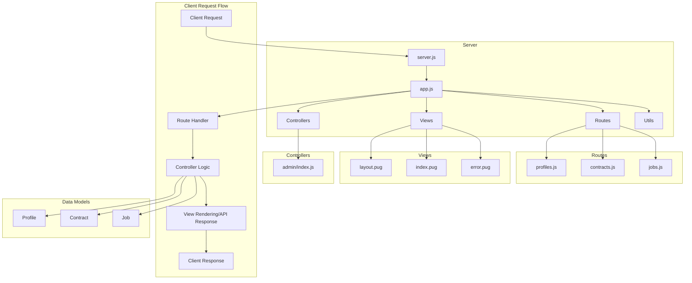

# DEEL BACKEND

A web application built with Node.js and Express, featuring profile management, job listings, and contract handling.

## Project Structure

## Features

- Profile Management
- Job Listings
- Contract Handling
- Pug Template Engine for Views

## Prerequisites

- Node.js (version X.X.X)
- npm (version X.X.X)

## Installation

1. Clone the repository:
```bash
git clone <repository-url>
```

2. Install dependencies:
```bash
npm install
```

3. Start the development server:
```bash
npm start
```

The application will be available at `http://localhost:<port>`.

## API Routes

### Profiles
- Profile-related endpoints are handled in `src/routes/profiles.js`

### Jobs
- Job-related endpoints are handled in `src/routes/jobs.js`

### Contracts
- Contract-related endpoints are handled in `src/routes/contracts.js`

## Views

The application uses Pug as its template engine with the following views:
- `layout.pug`: Main layout template
- `index.pug`: Home page
- `error.pug`: Error page

## Contributing

1. Fork the repository
2. Create your feature branch (`git checkout -b feature/amazing-feature`)
3. Commit your changes (`git commit -m 'Add some amazing feature'`)
4. Push to the branch (`git push origin feature/amazing-feature`)
5. Open a Pull Request

## License

[Add your license here]

## Contact

[Add your contact information]

## Application Architecture



### Flow Description

1. **Entry Points**
   - `server.js`: Application entry point
   - `app.js`: Express application configuration

2. **Request Processing**
   - Incoming requests are first handled by Express middleware
   - Requests are routed to appropriate route handlers
   - Controllers process business logic
   - Views render responses or API sends JSON

3. **Core Components**
   - **Routes**: Handle URL routing and request distribution
   - **Controllers**: Contain business logic
   - **Views**: Pug templates for HTML rendering
   - **Utils**: Shared utility functions

4. **Data Flow**
   - Client makes HTTP request
   - Route handler processes request
   - Controller executes business logic
   - Data models handle database operations
   - Response sent back to client
